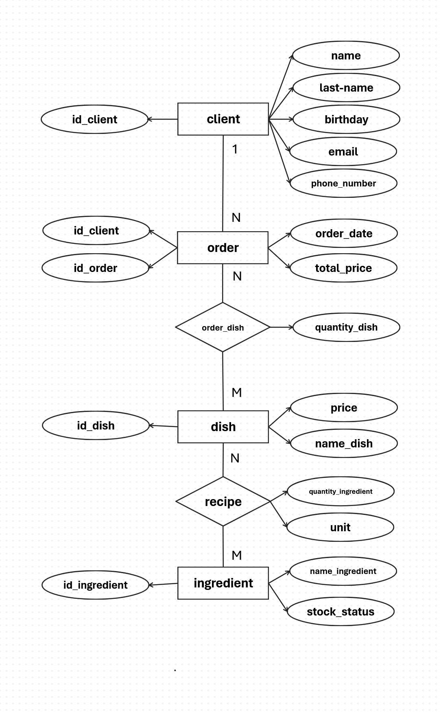

# TAKE

6th Semester Java REST API Group Project

---

## Project Description

TAKE is a backend REST API application developed as a 6th semester group project. It provides full CRUD operations and some extras for Clients, Orders, Dishes, Ingredients, 
and Recipes, enriched with HATEOAS links for easy navigation between related resources.

---

## Functional Requirements

- **Full CRUD** for all entities:
  - `Client`
  - `Order`
  - `Dish`
  - `Ingredient`
  - `Recipe`
- **HATEOAS** – every response includes hypermedia links to related resources.
- **Swagger Documentation** – interactive API documentation and testing.
- **Comprehensive Error Handling** (HTTP 4xx & 5xx) via centralized `@ControllerAdvice`.
- **No Authentication** – the API is publicly accessible.

---

## Technologies

- **Language:** Java 17  
- **Framework:** Spring Boot 3.4.4  
- **Spring Data JPA** (ORM & repositories)  
- **H2 Database** (in-memory runtime mode)  
- **Spring HATEOAS** (hypermedia links)  
- **Spring Validation** (input validation)  
- **MapStruct** (DTO Entity mapping)  
- **Lombok** (boilerplate reduction)  
- **Swagger UI** (`springdoc-openapi-starter-webmvc-ui`)  
- **Maven** (build & dependency management)

---

## ERD Diagram
Entity-Relationship Diagram illustrating how entities relate:

---

## Contributors

- [@jemek27](https://github.com/jemek27)
- [@jzolty](https://github.com/jzolty)
- [@kamm5](https://github.com/kamm5)
